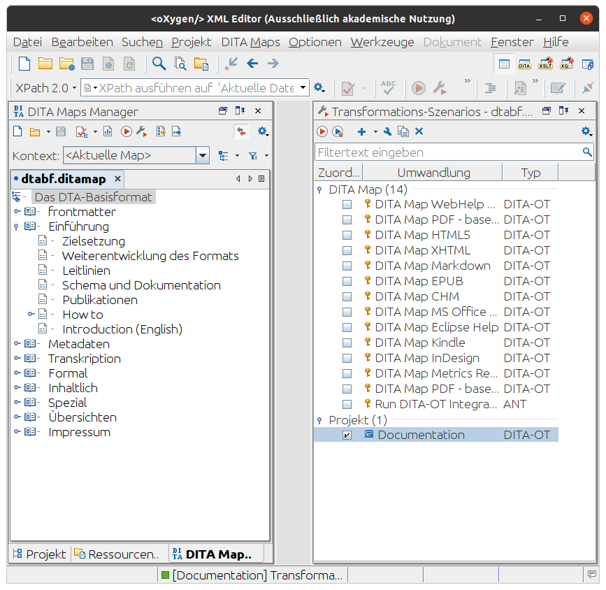

    
# DTA Base Format – Schema and Documentation

The DTA Base Format (DTABf) is a [TEI customization](https://tei-c.org/guidelines/customization/) for the annotation of digitized historical texts. It is the annotation basis for all texts published on the [Deutsches Textarchiv (DTA) platform](https://www.deutschestextarchiv.de/). 

To explore the DTABf documentation see [the official website](http://www.deutschestextarchiv.de/doku/basisformat). The DTABf documentation also contains information on how to access the [RNG schemas](http://www.deutschestextarchiv.de/doku/basisformat/schema.html) and how to use them. For elaborate information on the purpose of the format and constraints for its further development see the [DTABf Guiding Principles](http://www.deutschestextarchiv.de/doku/basisformat/leitlinien.html).

## Contact

The DTABf ist published by

**Deutsches Textarchiv** 
Berlin-Brandenburg Academy of Sciences and Humanities, Jaegerstr. 22/23, 10117 Berlin, Germany 
mailto:redaktion@deutschestextarchiv.de 
https://www.deutschestextarchiv.de

## Contributors

* Matthias Boenig
* Daniel Burckhardt
* Stefan Dumont
* Alexander Geyken
* Martina Gödel
* Susanne Haaf
* Axel Herold
* Christian Thomas
* Frank Wiegand

## Building

### Requirements

In order to build  RNG schemas of the DTABf and the documentation site, the following software is required:

* [**Python**](https://www.python.org/): Routines under `scripts/` for building the DTABf are written in the Python scripting language.
* [**Docker**](https://docs.docker.com/engine/): Compilation of RelaxNG schemas from TEI/ODD documents is achieved via a [containerized version](https://hub.docker.com/r/gremid/tei-stylesheets-action) of the [TEI XSL stylesheets](https://github.com/TEIC/Stylesheets).
* [**DITA Open Toolkit**](http://www.dita-ot.org/): Transformation of the documentation from [DITA (Darwin Information Typing Architecture)](http://dita.xml.org) to a responsive HTML website is achieved via the DITA Open Toolkit and [SyncRO Soft'S DITA-OT plugin for XML WebHelp](https://www.oxygenxml.com/xml_webhelp/webhelp_responsive.html).
* [**oXygen XML Editor**](https://www.oxygenxml.com/): Unless you licensed the aforementioned DITA-OT plugin separately, the SyncRO Soft's XML Editor suite is recommended as the runtime environment for the DITA/HTML conversion. It bundles DITA-OT as well as the plugin and also comes in handy as an editing environment for the DTABf schema and documentation.

### Building the RNG schemas

With Docker installed, running

    $ scripts/build-schema

will transpile the TEI/ODD resources under `schema/` into compiled ODD and RelaxNG schemas under `htdocs/`:

    $ ls htdocs/basisformat*
    htdocs/basisformat_all.odd  htdocs/basisformat_ohne_header.odd  htdocs/basisformat.rng
    htdocs/basisformat_all.xml  htdocs/basisformat_ohne_header.rng  htdocs/basisformat.sch
    htdocs/basisformat_ms.odd   htdocs/basisformat_ohne_header.xml  htdocs/basisformat_template.xml
    htdocs/basisformat_ms.rng   htdocs/basisformat_phase1.odd       htdocs/basisformat.xml
    htdocs/basisformat_ms.xml   htdocs/basisformat_phase1.rng
    htdocs/basisformat.odd      htdocs/basisformat_phase1.xml

### Building the documentation site

Open the project file `dtabf.xpr` in oXygen XML Editor (tested with v26.0) and execute the DITA-OT transformation scenario "Documentation". This will transform DITA resources under `documentation/`, starting from `dtabf.ditamap` and store the result under `htdocs/`, adjacent to the transpiled schema resources.

### Publishing to GitHub Pages

Once the schema resources and documentation have been built, the contents of `htdocs/` can be published to GitHub Pages via

    $ scripts/publish-gh-pages

## License

All files of the DTABf documentation and schema are distributed under a CC BY-SA 3.0 DE license (Creative Commons Namensnennung - Weitergabe unter gleichen Bedingungen 3.0 Deutschland). The license text is available on the [Creative Commons website](https://creativecommons.org/licenses/by-sa/3.0/de/legalcode). For all third party resources used by the DTABf documentation, license restrictions of the respective providers apply and are respected; see below for details.

### Third Party Copyright Information

The DTABf is based on the [P5 guidelines of the Text Encoding Initiative (TEI)](https://www.tei-c.org/Guidelines/P5). The TEI P5 guidelines were only reduced or tightened, never extended. Thus, the DTABf is fully compliant to TEI P5. The TEI P5 guidelines and adjacent software are distributed under the [Creative Commons Attribution 3.0 Unported License](http://creativecommons.org/licenses/by/3.0) and the [BSD 2-Clause license](http://www.opensource.org/licenses/BSD-2-Clause).

## Disclaimer

We do not grant any warranty for the product published here. For details see the [CC-BY-SA license](https://creativecommons.org/licenses/by-sa/3.0/de/legalcode).
